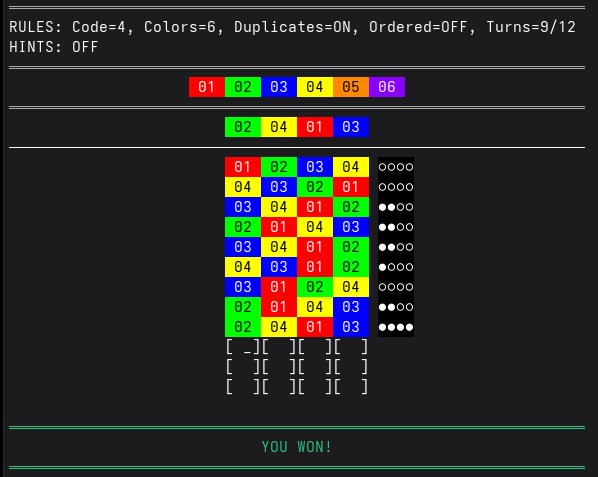

# Mastermind

[](https://goreportcard.com/report/github.com/Zappo-II/mastermind)
[](https://opensource.org/licenses/MIT)
[](https://go.dev/)

A terminal-based Mastermind code-breaking game written in Go, featuring true-color ANSI rendering, configurable rules, and a progressive hint system.

Built as a learning project to explore Go idioms and terminal programming — raw mode I/O, ANSI escape sequences, cross-platform terminal handling, and YAML-driven configuration. The game logic is fully tested and cleanly separated from the UI.



## Quick Start

**Prerequisites**

| Tool | Required | Install |
|------|----------|---------|
| Go 1.24+ | yes | https://go.dev/dl/ |
| GNU Make | optional | convenience targets; Windows: via MSYS2 or Git Bash |
| golangci-lint | optional | for linting; https://golangci-lint.run/welcome/install/ |

Without Make, see [manual build](#without-make) below.

```bash
make run
```

This runs the tests, compiles the binary, and starts the game with the default configuration.

## Build

```bash
make build
```

`make build` automatically runs `go vet` and the test suite first — the build fails if either fails. The binary is written to `bin/mastermind`.

All available targets (`make help`):

```bash
make help    # show available targets
make build   # vet, test, then compile to bin/mastermind
make test    # run all tests
make run     # build + run with default configs
make vet     # go vet ./...
make lint    # golangci-lint run ./...
make cross   # cross-compile for macOS and Windows
make clean   # remove build artifacts
```

### Without Make

```bash
go test ./...
go build -o mastermind ./cmd/mastermind
./mastermind -level configs/default-level.yaml -palette configs/default-palette.yaml
```

## Run

Both flags are optional. Without them the game looks for `default-level.yaml` and `default-palette.yaml` in the current directory.

| Flag | Default | Description |
|------|---------|-------------|
| `-level` | `default-level.yaml` | Path to level config |
| `-palette` | `default-palette.yaml` | Path to palette config |

### Level Presets

Five level configs are included:

| Preset | Code | Colors | Duplicates | Guesses | Hints | Based on |
|--------|------|--------|------------|---------|-------|----------|
| `default-level.yaml` | 4 | 6 | yes | 12 | disabled | Original 1972 Mastermind |
| `easy-level.yaml` | 4 | 6 | no | 12 | free, unlimited | Original 1972 (easy mode) |
| `deluxe-level.yaml` | 5 | 8 | yes | 12 | cost 1, doubling | Deluxe Mastermind 1975 |
| `hard-level.yaml` | 6 | 10 | yes | 12 | cost 2, doubling, max 3 | Custom |
| `nightmare-level.yaml` | 12 | 12 | yes | 12 | disabled | Good luck |

```bash
./bin/mastermind -level configs/deluxe-level.yaml -palette configs/default-palette.yaml
./bin/mastermind -level configs/easy-level.yaml -palette configs/default-palette.yaml
./bin/mastermind -level configs/hard-level.yaml -palette configs/default-palette.yaml
./bin/mastermind -level configs/nightmare-level.yaml -palette configs/default-palette.yaml
```

## How to Play

A secret code of N colored slots is generated at the start. Your goal is to guess it within the allowed number of turns.

After each guess, feedback pegs tell you how close you are:

- **●** — right color, right position (exact)
- **○** — right color, wrong position (partial)
- **×** — wrong color (ordered feedback only)

The secret code is hidden behind a shield row at the top of the board. It reveals as colored blocks when the game ends.

### Controls

| Key | Action |
|-----|--------|
| `1-9` | Enter color number (auto-accepts if unambiguous) |
| `Enter` | Confirm pending digit or submit complete guess |
| `Space` | Confirm pending digit (does not submit row) |
| `Backspace` | Undo last slot or clear pending digit |
| `h` | Request a hint (shows cost, requires Enter to confirm) |
| `?` | Show help overlay |
| `q` | Quit |

### Multi-digit input (10+ colors)

When `maxColors` is 10 or higher, some digits need a second keystroke to disambiguate:

- Digits **2-9** auto-accept immediately (no valid two-digit number starts with them when max is 12)
- Digit **1** enters a pending state since 10, 11, 12 are possible — press a second digit, Enter, or Space to confirm
- Digit **0** also pends (harmless edge case)

## Configuration

The game is configured through two YAML files: a **level** file (rules and hints) and a **palette** file (colors and feedback pegs).

### Level Configuration

```yaml
rules:
  # Number of color slots in the secret code (4-12)
  codeLength: 4

  # Number of available colors from the palette (4-12)
  maxColors: 6

  # Allow duplicate colors in the secret code
  duplicates: true

  # Maximum number of guesses allowed (0 = unlimited, otherwise >= 8)
  maxTurns: 12

  # Per-position feedback pegs instead of aggregated counts
  orderedFeedback: false

hint:
  # Enable or disable the hint system entirely
  enabled: false

  # Turns consumed per hint request (0 = free, 1-9)
  cost: 0

  # Cost multiplier per hint (1 = flat, 2 = doubling: 1,2,4,8...)
  costFactor: 1

  # Maximum number of hints allowed per game (0 = unlimited)
  maxHints: 0

  # false = reveal colors first, then positions
  # true  = reveal positions only, from the start
  sortByOrder: false
```

### Palette Configuration

Defines 12 colors, each with a number (1-12), name, background RGB, and foreground RGB for text contrast:

```yaml
colors:
  - number: 1
    name: RED
    rgb: "#FF0000"
    fg: "#FFFFFF"
  # ... (12 colors total)

feedback:
  exact:
    colorNumber: 10
    symbol: "\u25CF"    # ●
  partial:
    colorNumber: 10
    symbol: "\u25CB"    # ○
  empty:
    colorNumber: 10
    symbol: "\u00D7"    # × (ordered feedback only)
```

The palette must always contain exactly 12 colors numbered 1-12. The level's `maxColors` setting controls how many are used in a given game.

## Hint System

Press `h` during play to request a hint. If the hint has a cost, you'll see the turn cost and must press Enter to confirm.

### Cost model

Each hint costs `cost * costFactor ^ hintsAlreadyGiven` turns:

| Hint # | cost=1, factor=1 | cost=1, factor=2 | cost=2, factor=2 |
|--------|------------------|------------------|------------------|
| 1st | 1 | 1 | 2 |
| 2nd | 1 | 2 | 4 |
| 3rd | 1 | 4 | 8 |
| 4th | 1 | 8 | 16 |

Set `cost: 0` for free hints. Set `costFactor: 1` for flat cost.

The prompt only advertises `h hint` when a hint is both available and affordable. If the next hint would cost more turns than remain, the game tells you so.

### Hint modes

**Colors-first** (`sortByOrder: false`): Reveals which colors are in the code (without positions) for the first `codeLength` hints, then reveals positions one by one for the next `codeLength` hints. Colors are revealed in a shuffled order to prevent information leakage about remaining colors. Maximum `2 * codeLength` hints.

**Positional** (`sortByOrder: true`): Reveals positions cumulatively from left to right. Hint 1 shows position 1, hint 2 shows positions 1-2, etc. Maximum `codeLength` hints.

### Hint display

Hints appear as rows in the guess area:

- **Positioned** colors render as full colored blocks at their actual position
- **Unpositioned** colors fill into empty slots as dim bracketed numbers `[05]`
- Cost rows are consolidated into a single `[── cost x3 ──]` bar

## Feedback Modes

**Unordered** (`orderedFeedback: false`): Feedback pegs are shown as aggregated counts after the guess. You know how many exact and partial matches but not which positions. Example: `●●○` means 2 exact, 1 partial.

**Ordered** (`orderedFeedback: true`): Feedback pegs are shown in position order left-to-right, one per guess slot. Each peg is ● (exact), ○ (partial), or × (miss). Example: `●×○●×○` tells you exactly which positions matched.

## Testing

```bash
make test
```

Tests cover the core game logic (feedback calculation, hint cost/availability, win/lose state transitions), configuration validation (level rules, palette constraints, cross-validation), and model helpers. `make build` runs the test suite automatically before compiling.

## Project Structure

```
mastermind/
├── cmd/mastermind/
│   └── main.go              # Entry point, game loop, input handling
├── configs/
│   ├── default-level.yaml   # Original 1972 Mastermind (4 pegs, 6 colors)
│   ├── deluxe-level.yaml    # Deluxe Mastermind (5 pegs, 8 colors)
│   ├── easy-level.yaml      # Kids / beginners (4 pegs, 6 colors)
│   ├── hard-level.yaml      # Experienced players (6 pegs, 10 colors)
│   ├── nightmare-level.yaml # Maximum difficulty (12 pegs, 12 colors)
│   └── default-palette.yaml # 12-color palette
├── internal/
│   ├── config/
│   │   ├── config.go        # YAML loading and validation
│   │   └── config_test.go
│   ├── game/
│   │   ├── game.go          # Code generation, feedback, hints
│   │   └── game_test.go
│   ├── model/
│   │   ├── model.go         # Type definitions
│   │   └── model_test.go
│   └── ui/
│       ├── ui.go                # ANSI rendering
│       ├── term_unix.go         # Raw terminal mode (Unix)
│       ├── term_ioctl_linux.go  # termios constants (Linux)
│       ├── term_ioctl_bsd.go    # termios constants (macOS/BSD)
│       └── term_windows.go     # Raw mode + VT processing (Windows)
├── .gitignore
├── LICENSE
├── Makefile
├── go.mod
└── go.sum
```

## Requirements

- Terminal with true-color (24-bit) support
- Linux, macOS, FreeBSD, NetBSD, OpenBSD, or Windows 10+
- Windows requires Windows Terminal or a console that supports VT/ANSI escape sequences

## Disclaimer

**Mastermind** is a registered trademark of Invicta Plastics Ltd. This project is an independent, non-commercial implementation built for educational purposes and is not affiliated with, endorsed by, or connected to Invicta Plastics Ltd. or Hasbro, Inc.

## Topics Covered

- Raw terminal I/O without external TUI frameworks
- True-color (24-bit) ANSI rendering
- Cross-platform syscalls (Linux, macOS, Windows)
- YAML-driven configuration with validation
- Test-driven game logic separated from UI
- Makefile build pipeline with vetting and linting

## License

MIT
